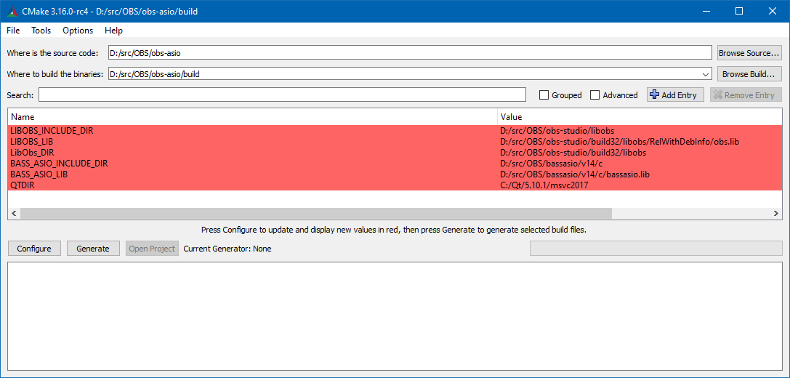
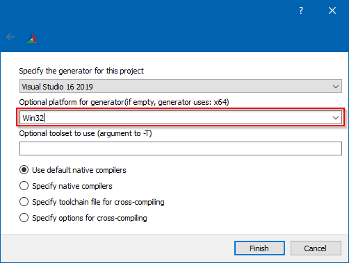

# obs-asio

  

## ASIO plugin for OBS-Studio

**Authors** :  pkv <pkv.stream(a)gmail.com> & Andersama <anderson.john.alexander(a)gmail.com>

## What is ASIO ?

Audio Stream Input/Output (ASIO) is a computer sound card driver protocol for digital audio specified by Steinberg, providing a low-latency and high fidelity interface between a software application and a computer's sound card. Whereas Microsoft's DirectSound is commonly used as an intermediary signal path for non-professional users, ASIO allows musicians and sound engineers to access external hardware directly. (From [ASIO Wikipedia article](https://en.wikipedia.org/wiki/Audio_Stream_Input/Output) ).

## This plugin

* We developed a plugin for [OBS Studio](https://obsproject.com/) which is a leading open-source streaming and compositing software.
* It allows capture of ASIO sound devices, which are often professional or semi-professional grade hardware for studio or home-studio use. * The plugin is designed for Windows and has been tested on windows 10 x64.
* There are four versions but only two are released. They can be found on branches asiobass, asioportaudio, asioportaudio_v2, asiort of this repo.
  * They use different audio API to host asio drivers (namely Bassasio, Portaudio and RtAudio).
  * The Bassasio plugin has the most functionalities; it allows multi-device as well as multi-client operation.
  * The 2 Portaudio plugins have multi-client but not multi-device capability.
  * The portaudio plugin v2 differs from portaudio plugin v1 in allowing sources with different devices although only one device is active.
  * The RtAudio based plugin is the most basic one and is not released.
* Multi-device capability means several asio devices can be used at the same time with OBS Studio. Most applications written with ASIO support including DAW's are limited to one device.
* Multi-client capability means OBS can create several asio sources with different channel selections from the same device.

## Installation and Usage

[Check the wiki](https://github.com/pkviet/obs-asio/wiki/Installation-and-Usage)

## How to compile and install the plugin

For my specific usecase - to be able to grab Rocksmith 2014 audio through Reaper, I'm opting here for building with [bassasio](https://www.un4seen.com/).

1. Clone [obs-studio](https://github.com/obsproject/obs-studio) and build it as per [the instructions](https://github.com/obsproject/obs-studio/wiki/Install-Instructions#windows-build-directions). The interesting configuration is **`RelWithDebInfo`**.
2. Download [bassasio v14](https://www.un4seen.com/download.php?bassasio14) or check for newer even on [the website](https://www.un4seen.com/) and get that. Unpack it somewhere handy.
3. Clone this project (either from my repo or from the upstream at `git@github.com:Andersama/obs-asio.git`), go into the repository directory and switch to the `asiobass` branch:

    ```bash
    git clone git@github.com:Andersama/obs-asio.git
    git checkout asiobass
    ```
  
    My version diverges from the upstream only on branch `asio-juce` for the time.

4. Create a directory inside - `build`, `build32` or `build64`, depending on what you're trying to achieve.
`build` just works, but if you aim for both x86 and x64 support, just name it accordingly.
5. Go inside that directory and configure the project with CMake. You can do that via command line or via `cmake-gui.exe`.
    The needed variables are:

    * `QTDIR` - same as in `obs-studio` build process.
    * `LibObs_DIR` - should be the path to `obs-studio/<your-build-directory>/libobs` - there's a generated `LibObsConfig.cmake` file there that will help with the build.
    * `LIBOBS_INCLUDE_DIR` - path to `obs-studio/libobs` (the folder contains `obs.h`.
    * `LIBOBS_LIB` - `obs-studio/<your-build-directory>/libobs/RelWithDebInfo/obs.lib`. The for-release builds should always have debugging information and the accompanying `.pdb`.
    * `BASS_ASIO_LIB` - make it point towards the correct (mind the bitness) version between `bassasio/v14/c/bassasio.lib` and `bassasio/v14/c/x64/bassasio.lib`. The stuff can be found from step 2 on your system.
    * `BASS_ASIO_INCLUDE_DIR` - towards `bassasio/v14/c`, also from step 2.

        Be mindful of the bitness, otherwise CMake will get fussy:

        

        

6. Open the generated solution and just build it.
7. `src/data/locale` should go into the OBS installation directory under `data/obs-plugins/obs-asio` and the generated `.dll` together with the correct (mind the bitness) version of `bassasio.dll` should go into the OBS installation directory under `obs-plugins/32bit` (or `64bit`...).

[Check the wiki](https://github.com/pkviet/obs-asio/wiki/Compilation-instructions)
